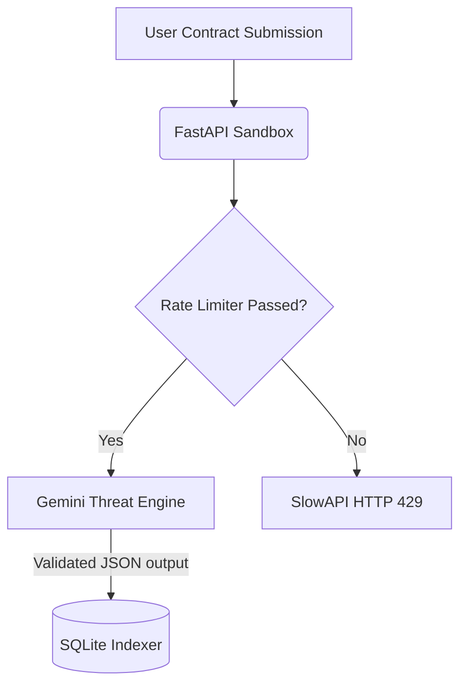

# Web3 Guard — Security & Threat Model

Web3 Guard is fundamentally a security tooling platform. Treating our internal infrastructure with the same rigor we analyze external smart contracts is paramount. Below is the completed Hackathon Security Checklist and Threat Model.

## 1. Hackathon Security Checklist (Level 6)

### Access Control & Rate Limiting
- [x] **API Rate Limiting:** Implemented via `slowapi` on the FastAPI backend. Strict limits of `5 req/min` for intensive AI scans and `10-20 req/min` for data indexing lookups (e.g., metric polling).
- [x] **CORS Configuration:** Explicit `CORS_ORIGINS` mapping using `.env` injections. We ensure the backend strictly accepts RPC requests only from the verified `web3guard.vercel.app` frontend domain in production.
- [x] **On-Chain Payload validation:** Front-end Freighter logic does not blindly encode JSON; it enforces type bounds (`nativeToScVal`) when interacting with the Soroban testnet, dropping malformed payloads.

### Privacy & Data Sanitization
- [x] **Minimal Database Footprint:** SQLite instances solely track hashed program addresses, sanitized vulnerability descriptions, and anonymized monitoring events. We do not store API keys or plaintext payloads generated by the Gemeni LLM.
- [x] **Wallet Opsec:** Stellar Wallet addresses are indexed (to fulfill tracking requirements) but are detached from highly sensitive identity mechanisms; no password tracking exists. Web3 Guard utilizes pure non-custodial bridging for fee sponsorships.

### Automated Agent Constraints (Scout & Defender)
- [x] **Safe-Mode Threat Isolation:** The autonomous Analyst agent uses static signature analysis heavily weighted over dynamic execution to avoid running malicious bytecode sent through `POST /api/ci`.
- [x] **Human-In-The-Loop (Defender):** The platform never executes an autonomous pause instruction (`/approve`) without explicit multi-party cryptographic confirmation initiated by the Telegram user payload.

## 2. Platform Architecture Security

Our AI engine (Gemini Flash Models) is sandboxed using structured output controls.

## 3. Vulnerability Reporting
If you discover a vulnerability in the Web3 Guard infrastructure (such as an SSRF via Etherscan/Helius lookup bypass, or an injection logic bomb), please reach out directly:
- **Email**: lohitmishra25@gmail.com
- **SLA**: Maximum 24-hour response metric during active monitoring.
- **Bounty**: Active bounties up to 5,000 XLM for Critical severity disclosures regarding the Web3 Guard anchor infrastructure.
